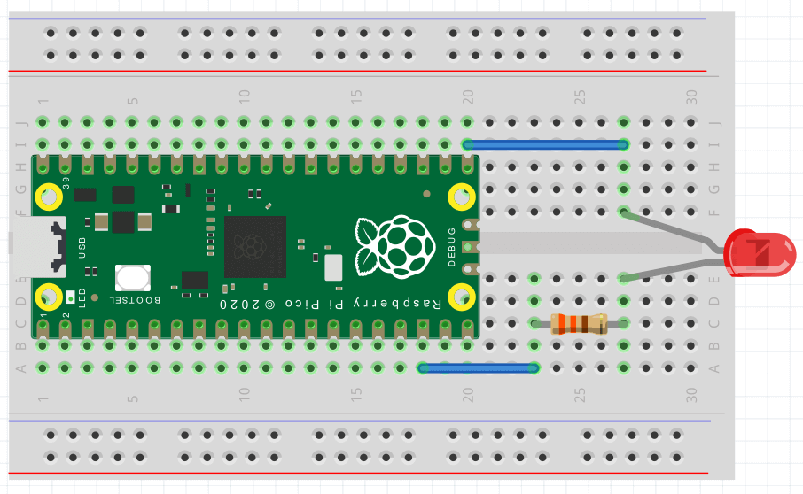

# Intro to Raspberry Pi Pico

The Raspberry Pi Pico is a microcontroller board used to connect to real-world I/O (input/output), something called embedded or physical computing. The following guides use the kit provided in the 'Raspberry Pi Pico - physical computing kit' from [NCCE](https://blog.teachcomputing.org/physical-computing-kits-the-story-so-far-2/), which are currently available for free for a half-term.

## Getting the Pico ready for Javascript

Most guides for the Pico use Python, and most devices you connect will have Python but not Javascript drivers. By using Javascript (via the Kaluma project) we are partly forced to learn more about low-level embedded programming by creating our own drivers.

- [Download the UF2 firmware](https://kalumajs.org/download/) (the non-W version).

- Hold the `BOOTSEL` button on your Pico while plugging in the micro-USB cable

- Copy the UF2 file you just downloaded to the RPI-RP2 drive volume

- The Pico should reboot itself, now running Javascript (you'll no longer see the drive volume, which is correct)

- Open https://www.mathsuniverse.com/pico in a browser

- Click "Connect to Pico" and select it from the list (you should see a welcome message in the black box)

- Use the Javascript REPL, eg by typing "3 + 4" and hitting enter (this runs your code on the Pico)

- Click "Flash bootloader" (only needed once; makes running code on the Pico faster)

## 1. Flashing the onboard LED

The Pico has a green LED next to the micro-USB port, connected to the `GPIO25` pin. We're going to write a few lines of code to flash the LED.

- Create a file `led-toggle.js` in VSCode, with contents:

  ```js
  let led = 25 // The GPIO pin the LED is connected to (see pinout diagram)
  pinMode(led, OUTPUT) // The LED is for output not input
  setInterval(() => {
    digitalToggle(led)
    console.log('Toggle') // You'll see this in the mock-terminal
  }, 100) // Runs every 100ms
  ```

- Back on https://www.mathsuniverse.com/pico, "Open Javascript file" and choose the file you just made

- Upload and run the JS file on the Pico by pressing "Run on Pico"

- You should see the LED flashing

**Extend**: The website auto-reloads your JS file when you make changes in VSCode. Change the last line of your code to 1000ms rather than 100ms then press "Run on Pico" again to upload the changes to the Pico (the flashing should now be slower). What else can you do with the onboard LED? Could you send a message in MORSE code?

## 2. Flashing an external LED

This time we're going to connect an LED using wires and a resistor on a breadboard, creating a circuit between any `GPIO` pin and any `GND` pin. I've chosen `GPIO16` and `GND` as shown below, because they're near the end of the Pico. If you choose a different `GPIO` pin, you'll need to change the pin number in the code to the number of the `GPIO` bin you choose.


The breadboard just makes it easier to connect bits of metal together, to complete the circuit between your chosen `GPIO` pin and a `GND` pin. To connect an external LED, we need a resistor connected in series (either before or after the LED; doesn't matter).

We could of course ignore the Pico and just make a regular circuit between a battery's terminals, with the LED and resistor in series. But by using the Pico instead we can turn our circuit on or off with code, using `digitalToggle(pinNum)`. Think of the `GPIO` pin as the positive terminal of a battery, and the `GND` as the negative terminal. A breadboard has bits of metal below the holes to connect some holes together and thus becoming part of the curcuit.

It's best to unplug your Pico before wiring changes to a circuit.

Connect your circuit using 2 wires, a resistor and an LED as shown below. Note that LEDs must be connected the right way round, with the longer/kinked leg (the anode) connected to `GPIO` and the short leg (the cathode) to `GND`.



With your curcuit connected, plug your Pico back in and:

- Edit or duplicate your `led-toggle.js` file, changing the pin to 16 (for `GPIO16`):

  ```js
  let led = 16 // This is all you need to change (was 25 before for onboard LED)
  pinMode(led, OUTPUT)
  setInterval(() => {
    digitalToggle(led)
    console.log('Toggle')
  }, 100)
  ```

- Back on https://www.mathsuniverse.com/pico, "Open Javascript file" and choose the file

- Upload and run the JS file on the Pico by pressing "Run on Pico"

- You should see the LED flashing. If you don't, try connecting your LED the other way around and make sure you have connected the 2 wires, resistor and LED correctly as shown above

**Extend:** Can you edit your code to separately control both LEDs? Or connect a 2nd LED on a different `GPIO` pin?

## 3. Controlling the onboard LED with a button

An LED is output; a button is input. In a regular curcuit, you can connect a button in series to an LED so when you hold the button the LED lights, and turns off on release.

Instead, we're going to connect a button to a `GPIO` pin, so we can listen to button click events in our code (like we would a button click event on a web page), allowing us to do whatever we want with it.

With the Pico unplugged, create the circuit shown below. We're keeping things simple by connecting the button to `GPIO16` again.


Create a file with the following JS and run it on the Pico:

```js
// Use Kaluma's button class. See: https://kalumajs.org/docs/api/button
let { Button } = require('button')
let btn = new Button(16) // 16 is the GPIO pin the button is connected to
btn.on('click', () => {
  console.log('Button clicked!')
})
```

... when you press the button, you should see 'Button clicked!' appearing in the mock-terminal.

The onboard LED is connected to `GPIO25`. We want to toggle it every time the button is clicked:

```js
let { Button } = require('button') 
let btn = new Button(16)
let led = 25 // add this line
pinMode(led, OUTPUT) // add this line
btn.on('click', () => {
  digitalToggle(led) // add this line
  console.log('Button clicked!')
})
```

... now, the LED should toggle on/off with every button click.

**Extend:** you could create a simple game with the button and the onboard LED. A mini whack-a-mole where the LED lights at random intervals and you get a point by pressing the button quick enough when it lights up. The score can be shown via `console.log(score)`.

## 4. Controlling an external LED with a button

You need to connect both the button and an LED, to different `GPIO` pins. You could follow the circuit diagram below, or choose a different arrangement. Here we're leaving the button to `GPIO16` and connecting the LED to `GPIO17`. Note that `GND` pins have squared off edges, to help you find them.


If connected correctly, you should be able to modify one line of code from the previous guide to use the external rather than onboard LED. Or you may want to control both LEDs:

```js
let { Button } = require('button')
let btn = new Button(16)
let onboardLed = 25
let externalLed = 17
pinMode(onboardLed, OUTPUT)
pinMode(externalLed, OUTPUT)
btn.on('click', () => {
  digitalToggle(onboardLed)
  digitalToggle(externalLed)
  console.log('Button clicked!')
})
```

**Extend:** Connect a 2nd button and take your whack-a-mole game further by having each button responsible for whacking a different mole/LED.

## 5. Sensing with infrared

We're going to use `HW-201` which is an infrared sensor. It has an infrared LED which reflects (invisibly to humans) off objects and is received/read by the receiver. It also has an adjustable potentiometer for changing the detectable distance. [More info](https://www.circuits-diy.com/hw201-infrared-ir-sensor-module/). It has 3 clearly labelled pins:

- `OUT` for its single output (which the Pico sees as an input)
- `VCC` for 3.3V of power
- `GND` for ground

Complete the circuit for the `HW-201` as shown. The `HW-201` can be connected to the holes in the breadboard directly:


The output from the `HW-201` is either HIGH (1) or LOW (0) depending on whether or not an object is sensed within a certain distance. This distance can be tweaked by adjusting the potentiometer if needed.

Try this code with your completed circuit:

```js
let irPin = 16
pinMode(irPin, INPUT)
setInterval(() => {
  let val = digitalRead(irPin)
  console.log(`Sensed? ${val ? 'no' : 'yes'}`)
}, 1000)
```

Run the code. If you put your hand in front of the sensor a 2nd LED on the sensor should light. Every second, your code will log to the console whether or not something was sensed.

**Extend:** Add a red LED to your circuit. When the IR sensor senses something have the red LED light, otherwise light the onboard green LED. You may also ant to decrease the `setInterval()` interval from 1s to a lower value. 

## 6. Sensing with ultrasound

Now we're going to connect up a `HC-SR04` ultrasonic distance sensor. This will tell us how far away objects are from the sensor - not just yes/no for being sensed. This is significantly more complex to handle in our code - to get a distance, we're measuring the time in microseconds between transmitting and the echo being received back, and making calculations based on the speed of sound.

When using new devices, the best way to find out about them is to search for their name/part-number (usually written somewhere on the device) and sometimes adding 'datasheet' or 'examples'. Pins on the device will usually be labelled in someway, to suggest what they're for - if not, the datasheet should explain things.

In this case, the `HC-SR04` has 4 clearly labelled pins:
- `Vcc` for power
- `Trig` output for trigger/transmit
- `Echo` input to receive
- `Gnd` for ground

Most online guides will be in C/C++ or Python rather than Javascript. In this case, I found a [guide](https://www.instructables.com/Simple-Arduino-and-HC-SR04-Example/) and [code](https://github.com/sparkfun/HC-SR04_UltrasonicSensor/blob/master/Firmware/HC-SR04_UltrasonicSensorExample/HC-SR04_UltrasonicSensorExample.ino) in another language and converted it to Javascript making use of similar functions available in the [Kaluma API](https://kalumajs.org/docs).

The circuit diagram shows 8 wires, but actually you only need 4. You can plug the `HC-SR04` directly in to the 4 holes on the breadboard (bottom-right) instead of using wires. `Vcc` connects to the `3V3 (OUT)` pin of the Pico (which means 3.3volts) and `Gnd` connect to any Pico `GND` pin. The output `Trig` and input `Echo` connect to any `GPIO` pins - in this case, `GPIO17` and `GPIO16`.


The code for this is quite a bit longer:

```js
let trigPin = 17
let echoPin = 16
let maxDist = 23200 // ~400cm

pinMode(trigPin, OUTPUT)
pinMode(echoPin, INPUT)
digitalWrite(trigPin, LOW)

setInterval(() => {
  // Hold the trigger pin high for 10+ microseconds
  digitalWrite(trigPin, HIGH)
  delayMicroseconds(10)
  digitalWrite(trigPin, LOW)

  // Wait for pulse on echo pin
 while (digitalRead(echoPin) === 0) {
    // no-op; just wait
  }

  // Measure how long the echo pin was held high (pulse width)
  // Note: the micros() counter will overflow after ~70 min
  let t1 = micros()
  while (digitalRead(echoPin) === 1) {
    // no-op; just wait
  }
  let t2 = micros()
  let pulseWidth = t2 - t1

  // Calculate distance in cm
  // Uses numbers from the datasheet, calculated from air speed of sound at sea level (~340 m/s)
  let cm = Math.round(pulseWidth / 58)

  // Show the distance
  console.log(pulseWidth > maxDist ? `Out of range` : `${cm}cm`)
}, 1000)
```

Try running the code with the correct circuit and you should see the distance logged to the console in the mock-terminal every second.

**Extend:** Add a red LED to your circuit. When the latest distance is < 5cm show the red LED, or if >= 5cm light the onboard green LED. You may also ant to decrease the `setInterval()` interval from 1s down to around 50ms.

## 7. Turning wheels with motors and a motor driver

`L298N` is a motor driver, driving up to 2 motors, which can be connected to wheels. Motors require more power than the 3.3V the Pico outputs, so you'll need separate power supplies for them. The kit we have includes battery packs holding 4 AA batteries. Each battery provides 1.5V, making 6V per pack. It looks like we need up to 12V here, so 2 battery packs connected in series (8 x 1.5V AA batteries in all). But actually, 1 battery pack with 4 x 1.5V AA batteries is enough for now.

We're going to start by creating the simplest circuit we can for one motor, with forward/back/stop controls but no control over the speed.

Using the photo below as a guide **with the Pico unplugged**:
- connect a motor to the terminals on the left (red top; black bottom)
- connect a wheel to the motor
- keep the battery pack open and simply displace a battery to turn the pack off
- connect a battery pack to the 2 left-most terminals on the row of 3 terminals bottom-left (red-wire left; black-wire middle)
- use male-female jumper wires to connect `GPIO17` to `IN1` (left most of 4 male headers), and `GPIO16` to `IN2` (left-but-one of 4 male headers) on the `L298N`
- ensure jumpers are in place left and right of the 4 headers, and also in the bottom-left corner between the 2 and 3 terminals


Here's our simple code:

```js
let input1 = 17
let input2 = 16

pinMode(input1, OUTPUT)
pinMode(input2, OUTPUT)

stopMoving()

function forward () {
  digitalWrite(input1, HIGH)
  digitalWrite(input2, LOW)
}

function backward () {
  digitalWrite(input1, LOW)
  digitalWrite(input2, HIGH)
}

function stopMoving () {
  digitalWrite(input1, LOW)
  digitalWrite(input2, LOW)
}
```

Connect the batteries and a red LED should light on the motor driver. Connect the Pico and run the code above. Nothing should happen, because we call `stopMoving()` on load. 

In the mock-terminal, enter `forward()` and you should see the wheel spinning. Then try `backward()` and it should spin the other way. Or `stopMoving()` to stop the wheel.

**Extend:** Add 2 buttons and an external LED to your circuit. One button should start/stop the motor. The other button should toggle forward/backward motion. Light the green LED when going forward, or the external LED when going backward.

## 8. Control motor speed

_TBC: Not ready yet... but you can try experimenting and let me know!_

For this we need pulse width modulation (PWM). See [PWM in the Kaluma docs](https://kalumajs.org/docs/api/pwm). But we also really need an analog control (eg potentiometer) which we don't have yet. You could try setting different speeds with different functions/buttons I guess.

Read [this](https://howtomechatronics.com/tutorials/arduino/arduino-dc-motor-control-tutorial-l298n-pwm-h-bridge/) and [this](https://lastminuteengineers.com/l298n-dc-stepper-driver-arduino-tutorial/) guide to learn what you need about the `L298N` and PWM.

_TBC_


---

## Looking for more?

Using other devices with Javascript may involve reading datasheets and going lower-level than you would need to if using Python, often creating your own device drivers because there aren't many guides to using the Pico with Javascript online (yet!). It will help to [look through the KalumaJS docs](https://kalumajs.org/docs) and try to find code in other languages. There are some Kaluma [tutorials](https://kalumajs.org/docs/tutorials) and [examples](https://github.com/kaluma-project/examples) which should help too.